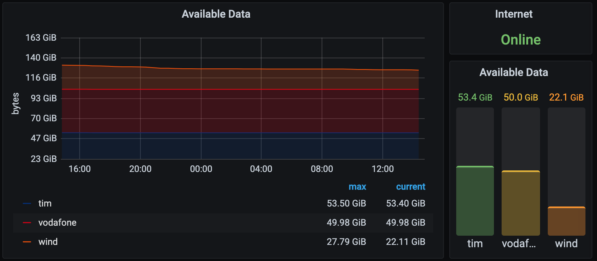
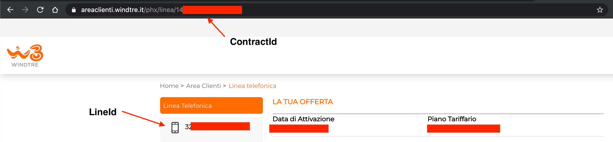

# Carrier Exporter

Prometheus exporter for Italian carrier data, written in Go.
It supports TIM, Vodafone, Wind/3.

## Getting started

### Prepare the config.yml

Rename `config.example.yml` to `config.yml`. Change variables with yours.

### Wind:

- Username / Password: your credentials.
- ContractId: You can find it in the URL when you login on Wind/3 portal: E.G: https://areaclienti.windtre.it/phx/linea/<THIS_IS_YOUR_LINE_ID>
- LineId: your number (without +39, only numbers).

### TIM

- Username / Password: your credentials.
- Phone: your phone (without +39, only numbers).

### Vodafone

- Username / Password: your credentials.
- Phone: your phone (without +39, only numbers).
- Counters item: This is the most difficult one to extract. You should run this software in debug mode, put a breakpoint in `internal/metrics/handle.go:112` and check the result of the `service.GetCounters` calls. There's a list of counters, you should get the id string that contains you GB counter.

### Run

- `make build`: it should create the binary in `dist/` folder.
- Put you `config.yml` near the binary.
- Run: `./carrier-exporter`
- You should get the exporter API in `http://localhost:2112/metrics` if you didn't change the application port.

## Code structure

I made this project for my own purposes, but the code should be clear and easy to modify.

- `cmd/carrier-exporter/main.go` the entry point of the app.
- `internal/<carrier>` the code involved to extract data from the `<carrier>`.
  - `container.go`: it manages instance creations.
  - `client.go`: it makes API calls.
  - `service.go`: it contains business logic to extract counters.
- `internal/timbrowser`: legacy TIM counter extractor that involves the browser. I don't use it anymore because it was CPU heavy. `intenal/tim` uses only the APIs and it's very light.

## FAQ

- *How do you get these API calls?*:
  - TIM: Inspecting API calls made by the browser.
  - Wind/3: Inspecting API calls made by the official app using [mitmproxy](https://mitmproxy.org/).
  - Vodafone: Disassembling official mobile app, bypassing [certificate pinning](https://owasp.org/www-community/controls/Certificate_and_Public_Key_Pinning), inspecting API calls using [mitmproxy](https://mitmproxy.org/).
